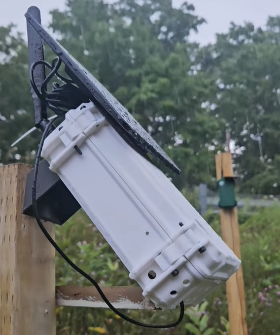

# Weather‑Station‑1 (ESP32)

An ESP32‑based, solar‑friendly weather station that logs to SD, serves a live dark‑mode dashboard, and exposes a clean HTTP API.

<p align="center">
  
  
</p>

---

## Features

- **Sensors:** BME680 (T/RH/P + gas), VEML7700 (ambient light)
- **Storage:** SD card (`/logs.csv`) with CSV header & rolling logs
- **Time:** DS3231 RTC (preferred) with NTP fallback
- **Connectivity:** Wi‑Fi Station with AP fallback, mDNS (configurable hostname)
- **Web UI:** Live dashboard, charts, log viewer & download
- **REST API:** `/live`, `/download`, `/view-logs`, `/config`, `/add`, `/del`, etc.
- **Power modes:** DAY (awake, periodic logs) / NIGHT (short serve window → deep sleep)
- **OTA:** ElegantOTA at `/update` (basic auth)

> Full endpoint and data schema: see **[docs/API.md](docs/API.md)**.

---

## Hardware

- **MCU:** ESP32 (DevKit style)
- **Sensors:** BME680 (I²C), VEML7700 (I²C)
- **RTC:** DS3231 (INT/SQW → GPIO2)
- **Storage:** microSD (SPI)
- **LED:** status LED on GPIO4
- **Rain gauge:** reed switch on GPIO27 (to GND)
- **Battery sense:** ADC pin 35 via 100k/100k divider

### Pinout (defaults)

| Function | Pin(s) |
|---|---|
| I²C SDA / SCL | 21 / 22 |
| SD CS / SCK / MISO / MOSI | 5 / 18 / 19 / 23 |
| Battery ADC | 35 |
| DS3231 INT | 2 |
| Status LED | 4 |
| Rain gauge | 27 |

---

## Repo layout

```text
.
├─ WaetherStation08_24_25_v18/   # Main Arduino sketch
├─ docs/API.md                  # API reference & schema
└─ README.md
```

---

## Getting started

If no saved networks are found, the ESP32 launches a **temporary AP** for ~3 minutes so you can add Wi‑Fi credentials at `/add`.

Default AP: SSID `WeatherStation1`, password `12345678`.

### Prerequisites

- **Arduino IDE** (or PlatformIO)
- **ESP32 board package**
- Libraries:
  - Adafruit BME680 + Adafruit Unified Sensor
  - Adafruit VEML7700
  - RTClib
  - ArduinoJson
  - ElegantOTA
  - Core: `WiFi`, `WebServer`, `ESPmDNS`, `SD`, `SPI`, `Preferences`

### Build & flash

1. Open `WaetherStation08_24_25_v18/WaetherStation08_24_25_v18.ino` in Arduino IDE.
2. Select your ESP32 board & COM port.
3. (Optional) Update default OTA/AP credentials in the sketch.
4. Upload the firmware.
5. Open **Serial Monitor** @ **115200** to see IP and **mDNS** name.

---

## Web interface & API

After boot and Wi‑Fi join, open:

**http://<mdnsHost>.local** (default: `weatherstation1.local`)

### Endpoints

| Endpoint        | Method | Description                                   |
|-----------------|--------|-----------------------------------------------|
| `/`             | GET    | Dashboard (live cards, charts, Wi‑Fi mgmt)    |
| `/update`       | GET    | ElegantOTA firmware upload (basic auth)       |
| `/download`     | GET    | Raw CSV log stream                            |
| `/view-logs`    | GET    | Recent rows in a table with filters           |
| `/config`       | GET/POST | Read/update persistent settings            |
| `/add`          | POST   | Add Wi‑Fi SSID/password                       |
| `/del?ssid=…`   | GET    | Delete a saved SSID                           |
| `/live`         | GET    | JSON telemetry & diagnostics                  |
| `/sleep`        | POST   | Enter deep sleep immediately                  |
| `/restart`      | GET/POST | Soft reboot                                 |

### Example `/live` JSON (selected fields)

```json
{
  "temp_unit": "F",
  "temp": 72.8,
  "temp_f": 72.8,
  "temp_c": 22.7,
  "hum": 43.2,
  "pressure": 1013.62,
  "lux": 455,
  "batt": 4.07,
  "voc_kohm": 12.5,
  "dew_f": 50.3,
  "hi_f": 73.9,
  "wbt_f": 54.4,
  "mslp_hPa": 1019.3,
  "mslp_inHg": 30.10,
  "pressure_trend": "Steady",
  "forecast": "Fair",
  "general_forecast": "Improving / Fair",
  "rain_mmph": 0.28,
  "rain_inph": 0.01,
  "rain_unit": "mm/h",
  "boot_count": 123,
  "uptime": 1234,
  "rssi": -56,
  "ssid": "MyWiFi",
  "time": "2025-01-01 15:42:17",
  "last_sd_log": "2025-01-01 15:40:00",
  "boot_started": "15:21:43",
  "wakeup_cause": 2,
  "wakeup_cause_text": "TIMER",
  "last_alarm": "2025-01-01 15:50:00",
  "sd_free_kb": 512000,
  "flash_free_kb": 2048,
  "heap": 176520,
  "sd_ok": true,
  "rtc_ok": true
}
```

---

## CSV log schema

File: `/logs.csv`

Header (14 columns):
```
timestamp,temp_f,humidity,dew_f,hi_f,pressure,pressure_trend,forecast,lux,voltage,voc_kohm,mslp_inHg,rain,boot_count
```

Example row (units: temp °F, pressure hPa, MSLP inHg, rain mm/h or in/h per setting):
```
2025-01-01 15:42:17,72.8,43.2,50.3,73.9,1013.62,Steady,Fair,455.0,4.07,12.5,30.10,0.28,123
```

Note: After the initial startup log, an extra boot event row is appended containing only the timestamp and `boot_count` (other columns blank).

---

## Power behavior

- **DAY:** stays awake; logs on cadence (`LOG_INTERVAL_MS`, default 10 min)
- **NIGHT:** short “serve” window after wake, then deep sleep (`DEEP_SLEEP_SECONDS`, default 10 min)
- Light thresholds (enter/exit DAY) use VEML7700 with hysteresis & dwell.

---

## Configuration

Open **`/config`** to adjust persistent settings (stored in Preferences):

- `altitude_m` — used for MSLP calculation  
- `temp_unit` — `F` or `C` (UI formatting)  
- `bat_cal` — ADC voltage calibration multiplier  
- `time_12h` — 12h or 24h display toggle  
- `rain_unit` — `mm/h` or `in/h` for log/UI rain values  
 - `lux_enter_day` — Daylight entry (lux). Default: 1600  
 - `lux_exit_day` — Night entry (lux). Default: 1400  
 - `log_interval_min` — Log interval (minutes) while awake. Default: 10  
 - `sleep_minutes` — Deep sleep duration (minutes) between wakes. Default: 10  
 - `trend_threshold_hpa` — Pressure trend threshold (hPa). Default: 0.6  
 - `mdns_host` — mDNS hostname label (no `.local`)  

Wi‑Fi networks are managed via:

- `POST /add` (add SSID/password)  
- `GET /del?ssid=...` (delete SSID)

---

## Security notes

- OTA endpoint `/update` uses **basic auth** — change the defaults before deploying.  
- `/add` and `/config` are plain HTTP; run on a trusted LAN.

---

## Troubleshooting

- If **mDNS** fails, use the serial‑printed IP or your router’s DHCP leases.
- If **SD** fails, verify wiring, CS pin, and card format.
- If **BME680** or **VEML7700** aren’t detected, check I²C wiring/addresses.
- If **RTC** is absent, the device falls back to timer‑only wakes.

---

## Roadmap (ideas)

- Optional AQ modules: MiCS‑5524, SCD41  
- Power metering: INA3221 (I have Just need to weire)
- Wind subsystem: wind vane, accelerometer  (I have hall sensors)
- RGB LED Status debugging

---

## Implemented Hardware
- [UV sensing: S12SD UV Index](https://www.amazon.com/dp/B0CDWXCZ8L?ref=ppx_yo2ov_dt_b_fed_asin_title)
- [Solar/charging: 900 mA MPPT controller (Efficiency approved)](https://www.amazon.com/dp/B07MML4YJV?ref=ppx_yo2ov_dt_b_fed_asin_title)
- [Lonely Binary ESP32-S3 Development Board-16MB Flash, 8MB PSRAM, IPEX Antenna (Gold Edition)](https://lonelybinary.com/en-us/collections/esp32/products/esp32-s3-ipex?variant=43699253706909)

## Credits
- Main enclosure based on [Thingiverse model](https://www.thingiverse.com/thing:4094861)
- Rain gauge: [Tipping bucket rain meter](https://www.printables.com/model/641148-tipping-bucket-rain-meter)
Built by @JoshLongmire and contributors. Libraries by Adafruit, Ayush Sharma (ElegantOTA), and the Arduino community.
