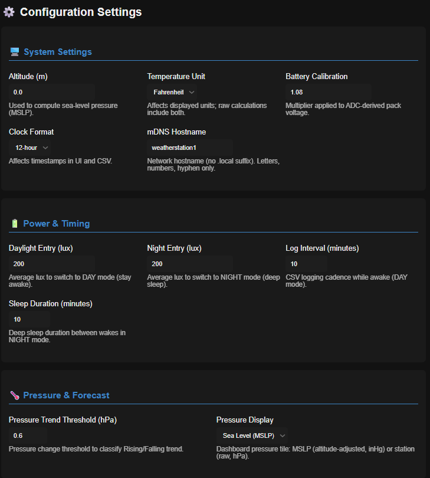
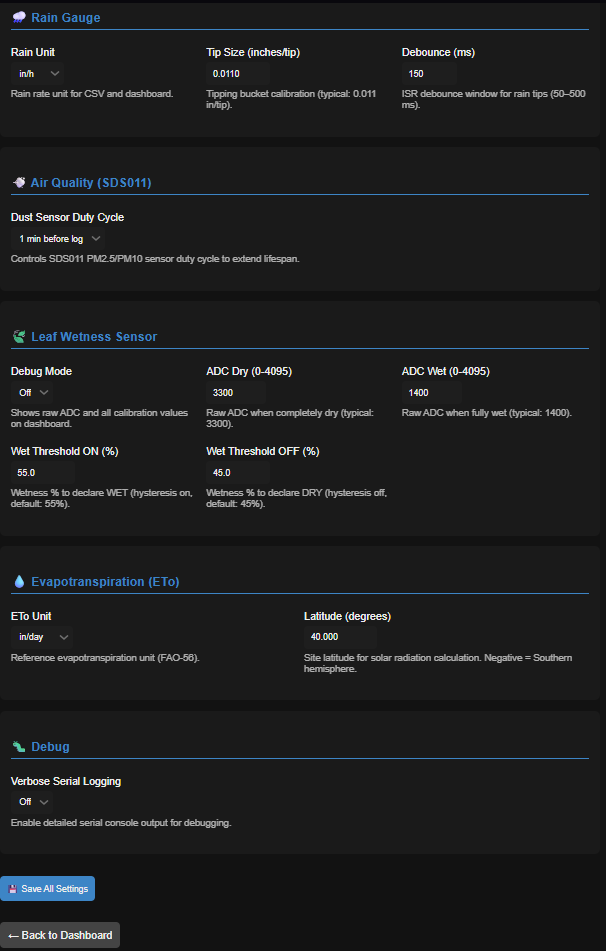

# Weather‑Station‑1 (ESP32)

[](LICENSE)
[](https://www.arduino.cc/)
[](https://www.espressif.com/)
[](CHANGELOG.md)
[](https://github.com/JoshLongmire/Weather-Station-1-ESP32/commits/main)

An ESP32‑based, solar‑friendly weather station that logs to SD, serves a live dark‑mode dashboard, and exposes a clean HTTP API.

<p align="center">
  
  
  
  
  
  
</p>


<p align="center" style="font-size: 12px; opacity: 0.8; margin-top: -4px;">
  Photos: © Weather‑Station‑1 contributors — Licensed CC BY‑4.0
</p>

---

## 📑 Table of Contents

- [Features](#features)
- [Modular Architecture](#-modular-architecture-v20-new)
- [Hardware](#hardware)
- [Bill of Materials](#-bill-of-materials)
- [Repo Layout](#repo-layout)
- [Getting Started](#getting-started)
- [Web Interface & API](#web-interface--api)
- [CSV Log Schema](#csv-log-schema)
- [Power Behavior](#power-behavior)
- [Configuration](#configuration)
- [Security Notes](#security-notes)
- [Troubleshooting](#troubleshooting)
- [Roadmap](#roadmap-ideas)
- [3D Printed Components](#3d-printed-components)
- [Licenses](#licenses-and-thirdparty-notices)

---

## Features

- **Sensors:** BME680 (T/RH/P + gas), VEML7700 (ambient light); optional: UV analog (GUVA‑S12SD), SDS011 (PM2.5/PM10), Hall anemometer (wind), Wind vane (PCF8574), Leaf wetness (LM393)
- **Storage:** SD card (`/logs.csv`) with CSV header & rolling logs
- **Time:** DS3231 RTC (preferred) with NTP fallback and daily drift check
- **Connectivity:** Wi‑Fi Station with AP fallback, mDNS (configurable hostname)
- **Web UI:** Live dashboard with dark theme, real-time charts, log viewer & download
- **REST API:** `/live`, `/download`, `/view-logs`, `/config`, `/add`, `/del`, etc.
- **Power modes:** DAY (awake, periodic logs) / NIGHT (short serve window → deep sleep)
- **OTA:** ElegantOTA at `/update` (basic auth)
- **Advanced Features:** 
  - **Enhanced Multi-Sensor Forecast** — Advanced weather prediction using deep sensor fusion (pressure trends, humidity, wind, temperature, UV, rain) with storm detection, frontal passage alerts, and 40+ distinct forecast states
  - Rain accumulation tracking (1h, daily, event totals with ≥6h dry gap reset)
  - Wind speed & gust (5-second max over 10 minutes) with 1-hour rolling average
  - Wind direction (8-point compass via PCF8574 I²C expander)
  - Leaf wetness monitoring with 24-hour wet-hours accumulation and runtime calibration
  - Reference evapotranspiration (FAO-56 ETo) with Penman-Monteith and Hargreaves-Samani methods
  - Dust sensor duty cycling (SDS011) with configurable presets
  - Enhanced organized dashboard with forecast prominently displayed at top-left (3-column span for comprehensive details)
  - Configurable pressure display (MSLP sea-level or station pressure)
  - **Advanced Configuration System** — Comprehensive settings with descriptive help text for dashboard customization, enhanced forecasting, and sensor calibration
  - **Dashboard Customization** — Adjustable refresh rates, dark/light themes, advanced metrics display, and chart history
  - **Enhanced Forecasting Controls** — Multi-sensor forecasting toggle, sensitivity levels, storm detection, and risk thresholds
  - **MQTT Integration** — Home automation support with configurable broker, topics, and publish intervals (Home Assistant, Node-RED compatible)
  - **Battery & Power Management** — Smart battery thresholds, solar power optimizations, and configurable deep sleep timeout

> Full endpoint and data schema: see **[docs/API.md](docs/API.md)**.

---

## 🏗️ Modular Architecture (v20) **NEW!**

The weather station firmware has been refactored into a clean modular architecture for easier maintenance and development:

### Project Structure
```
WeatherStationv20_modular/
├── WeatherStationv20_modular.ino  (348 lines)  — Main orchestrator
├── config.h / config.cpp          (212 lines)  — Configuration management
├── sensors.h / sensors.cpp        (736 lines)  — All sensor I/O & ISRs
├── weather.h / weather.cpp        (536 lines)  — 30+ meteorological calculations
├── power.h / power.cpp            (253 lines)  — Power & sleep management
├── storage.h / storage.cpp        (374 lines)  — SD card & CSV logging
├── mqtt.h / mqtt.cpp              (93 lines)   — MQTT integration
└── web.h / web.cpp                (2,020 lines) — Web server & all HTTP handlers
```

**Total**: 4,560 lines across 15 files (97% of original monolithic v19)

### Module Responsibilities

| Module | Purpose | Key Functions |
|--------|---------|---------------|
| **config** | Settings persistence & debug utilities | `loadAppConfig()`, `saveAppConfig()`, `debugPrintf()` |
| **sensors** | Hardware I/O, ISRs, sensor reading | `initializeSensors()`, `readLux()`, `rainIsr()`, `windIsr()` |
| **weather** | Meteorological calculations & forecasting | `computeDewPointC()`, `computeEtoHourly_mm()`, `generalForecastFromSensors()` |
| **power** | Day/Night modes, deep sleep, LED control | `updateDayNightState()`, `prepareDeepSleep()`, `updateStatusLed()` |
| **storage** | SD card operations & CSV logging | `performLogging()`, `updatePressureHistory()`, `getLogFilePath()` |
| **mqtt** | MQTT client & home automation integration | `connectToMqtt()`, `publishForecastToMqtt()`, `handleMqtt()` |
| **web** | HTTP server, WiFi, OTA, all web handlers | `handleRoot()`, `handleLive()`, `setupServerRoutes()`, `connectToWifi()` |

### Benefits

✅ **Easier Maintenance** — Each module has a single, well-defined purpose  
✅ **Isolated Changes** — Modify sensors without touching web code  
✅ **Testable Modules** — Each module can be tested independently  
✅ **Reduced Merge Conflicts** — Multiple developers can work on different modules  
✅ **Better Organization** — Find code faster with logical separation  
✅ **Compilation Verification** — All 57 functions from v19 preserved (100% feature parity)

### Verification

The modular refactoring has been thoroughly verified:
- ✅ All 57 functions from original code present
- ✅ All 11 HTTP handlers complete
- ✅ All 30+ meteorological calculations preserved
- ✅ All sensor logic intact (ISRs, ring buffers, accumulators)
- ✅ 30-column CSV schema identical
- ✅ 60+ JSON API fields unchanged
- ✅ Only 145 lines removed (3% cleanup: duplicate includes, whitespace)

---

## Hardware

- **MCU:** ESP32‑S3 (Lonely Binary Dev Board, 16MB Flash / 8MB PSRAM); classic ESP32 also works
- **Sensors:** 
  - BME680 (I²C) — temperature, humidity, pressure, VOC gas
  - VEML7700 (I²C) — ambient light (0-120k lux range)
  - Optional: GUVA‑S12SD (analog) — UV index
  - Optional: SDS011 (UART) — PM2.5/PM10 particulate matter
  - Optional: Hall anemometer (GPIO interrupt) — wind speed
  - Optional: PCF8574 (I²C) — 8-point wind vane direction
  - Optional: LM393 leaf wetness (analog) — moisture detection
- **RTC:** DS3231 (INT/SQW → GPIO2) with daily NTP sync and drift correction
- **Storage:** microSD (SPI)
- **LED:** status LED on GPIO37 (S3 mapping)
- **Rain gauge:** reed switch tipping bucket to GND (GPIO18 in S3 mapping)
- **Battery sense:** ADC pin with 100k/100k divider (GPIO4 in S3 mapping)

### Pinout (defaults)

| Function | Pin(s) |
|---|---|
| I²C SDA / SCL | 8 / 9 |
| SD CS / SCK / MISO / MOSI | 5 / 12 / 13 / 11 |
| Battery ADC | 4 |
| DS3231 INT | 2 |
| Status LED | 37 |
| Rain gauge (tipping) | 18 |
| Wind (Hall) | 7 |
| Wind vane (PCF8574) | I²C (0x20-0x27) |
| UV analog (GUVA‑S12SD) | 6 |
| Leaf wetness analog | 3 (S3), 34 (classic ESP32) |
| SDS011 UART | RX=16, TX=17 |

### Board specifics

Tested with the Lonely Binary ESP32‑S3 Development Board (16MB Flash, 8MB PSRAM, IPEX antenna). For board details and pinout, see the product page: [Lonely Binary ESP32‑S3 Dev Board (Gold, IPEX)](https://lonelybinary.com/en-us/collections/esp32/products/esp32-s3-ipex?variant=43699253706909).

---

## 🛒 Bill of Materials

### Required Components

| Component | Price (approx) | Notes | Link |
|-----------|----------------|-------|------|
| ESP32-S3 Dev Board (16MB/8MB) | $15-20 | Lonely Binary or equivalent | [Lonely Binary](https://lonelybinary.com/en-us/collections/esp32/products/esp32-s3-ipex?variant=43699253706909) |
| BME680 Sensor Module | $15-20 | Temperature, humidity, pressure, gas | [Amazon](https://www.amazon.com/dp/B0CDWXZNY7?ref=ppx_yo2ov_dt_b_fed_asin_title) |
| VEML7700 Light Sensor | $5-8 | 0-120k lux range | [Amazon](https://www.amazon.com/dp/B09KGYF83T?ref=ppx_yo2ov_dt_b_fed_asin_title) |
| DS3231 RTC Module | $5-8 | With CR2032 battery | Amazon/AliExpress |
| MicroSD Card (8-32GB) | $5-10 | FAT32 formatted, Class 10+ | Any retailer |
| Li-ion Battery (18650) | $5-10 | 3000mAh recommended | Any retailer |
| Enclosure | $0-20 | 3D printed or IP65 box | See 3D files below |

**Required Subtotal:** ~$50-90

### Optional Sensors & Accessories

| Component | Price (approx) | Feature | Link |
|-----------|----------------|---------|------|
| SDS011 PM Sensor | $25-30 | Air quality (PM2.5/PM10) | [Amazon](https://www.amazon.com/dp/B08QRJSVW7?ref=ppx_yo2ov_dt_b_fed_asin_title) |
| GUVA-S12SD UV Sensor | $8-12 | UV index measurement | [Amazon](https://www.amazon.com/dp/B0CDWXCZ8L?ref=ppx_yo2ov_dt_b_fed_asin_title) |
| Hall Anemometer + Wind Vane | $15-25 | Wind speed & direction | [Amazon](https://a.co/d/0iTu9BR) |
| PCF8574 I/O Expander | $3-5 | For wind vane interface | [Amazon](https://www.amazon.com/dp/B098B5CGYJ?ref=ppx_yo2ov_dt_b_fed_asin_title) |
| LM393 Leaf Wetness Sensor | $5-8 | Agriculture applications | Amazon/AliExpress |
| Tipping Bucket Rain Gauge | $15-30 | 3D printed or commercial | DIY (see 3D files) |
| Solar Panel (5W) | $10-20 | For 24/7 solar operation | [Amazon](https://www.amazon.com/dp/B0DPDNGYDV?ref=ppx_yo2ov_dt_b_fed_asin_title) |
| MPPT Charge Controller (900mA) | $8-12 | Battery charging | [Amazon](https://www.amazon.com/dp/B07MML4YJV) |
| Voltage Divider Resistors | $1-2 | 2x 100kΩ for battery sense | Any retailer |
| Reed Switches | $3-5 | For rain gauge & wind | Any retailer |

**Full System Cost:** ~$100-150 (basic) | ~$200-300 (fully loaded with all sensors + solar)

#### Verified purchase links (as used by this project)
- GPIO Expander PCF8574: [Amazon](https://www.amazon.com/dp/B098B5CGYJ?ref=ppx_yo2ov_dt_b_fed_asin_title)
- SDS011 High Precision PM2.5 Sensor: [Amazon](https://www.amazon.com/dp/B08QRJSVW7?ref=ppx_yo2ov_dt_b_fed_asin_title)
- VEML7700 Ambient Light Sensor Module: [Amazon](https://www.amazon.com/dp/B09KGYF83T?ref=ppx_yo2ov_dt_b_fed_asin_title)
- GUVA-S12SD UV Detect Sensor: [Amazon](https://www.amazon.com/dp/B0CDWXCZ8L?ref=ppx_yo2ov_dt_b_fed_asin_title)
- 3144E Hall Sensor Modules (10 pcs): [Amazon](https://www.amazon.com/dp/B09723WH5V?ref=ppx_yo2ov_dt_b_fed_asin_title)
- LM393 Rain Drops Sensor: [Amazon](https://www.amazon.com/dp/B01DK29K28?ref=ppx_yo2ov_dt_b_fed_asin_title)
- KOFU/OKI Reed Switches (6 pcs): [Amazon](https://www.amazon.com/dp/B0CW9418F6?ref=ppx_yo2ov_dt_b_fed_asin_title)
- DS3231 RTC Module (AT24C32): [Amazon](https://www.amazon.com/AITRIP-Precision-AT24C32-Arduino-Raspberry/dp/B09KPC8JZQ/ref=sr_1_5?crid=1BBM1A7IR757A&dib=eyJ2IjoiMSJ9.Av0ZT44mgzkEZLgrGYpmsc1bvAskDxukuEiBsIwEXkYXsy4pV1QL2kCmA6ATcUEOhtm86LcHQ3Ou8hoDzPAtWIL_MkbCcCGZqELL_JF2uIvDc5X5CHjf0QYUkwW1rr16e5uazRba5GyGkncrnCRiF33UoRrt3gmwKCu_76rOcOhUzpetDdE9-LbBG-jY1gpHfbe9xFJP3_h11FboQfv7qtcjeKRFkHxdTkyHdOtSbhA.KEgg1t8EO4x71IAhc9Eu8IFMK_E0WWU1dN-m4JL65EI&dib_tag=se&keywords=DS3231+RTC+Module&qid=1759834055&sprefix=ds3231+rtc+module+%2Caps%2C352&sr=8-5)
- BME680 Temperature/Humidity/Pressure/VOC: [Amazon](https://www.amazon.com/dp/B0CDWXZNY7?ref=ppx_yo2ov_dt_b_fed_asin_title)
- 5W Solar Panel: [Amazon](https://www.amazon.com/dp/B0DPDNGYDV?ref=ppx_yo2ov_dt_b_fed_asin_title)

### Tools Needed
- Soldering iron & solder
- Wire stripper
- Multimeter (for calibration)
- 3D printer (or access to one)
- Basic hand tools

---

## Repo layout

```text
.
├─ WeatherStationv20_modular/        # ⭐ Current modular firmware (v20)
│  ├─ WeatherStationv20_modular.ino # Main orchestrator (348 lines)
│  ├─ config.h / config.cpp          # Configuration management
│  ├─ sensors.h / sensors.cpp        # Sensor I/O & ISRs
│  ├─ weather.h / weather.cpp        # Weather calculations
│  ├─ power.h / power.cpp            # Power management
│  ├─ storage.h / storage.cpp        # SD card & logging
│  ├─ mqtt.h / mqtt.cpp              # MQTT integration
│  ├─ web.h / web.cpp                # Web server & handlers
│  └─ docs/                          # Module documentation
├─ WeatherStationv19/                # Legacy monolithic v19
├─ docs/                             # Project documentation
│  ├─ API.md                         # HTTP API reference
│  └─ *.png                          # Screenshots & diagrams
├─ CHANGELOG.md                      # Version history
├─ .cursor/rules/                    # AI coding rules
└─ README.md                         # This file
```

> **Latest Release:** v20.1-improved — Clean modular architecture with 8 code quality improvements: global timezone support, MQTT exponential backoff, 98.4% stack reduction, const correctness, and professional coding standards. Code quality: 9.5/10. See [CHANGELOG.md](CHANGELOG.md) for full version history.

---

## Getting started

If no saved networks are found, the ESP32 launches a **temporary AP** for ~3 minutes so you can add Wi‑Fi credentials at `/add`.

Default AP: SSID `WeatherStation1`, password `12345678`.

### Prerequisites

- **Arduino IDE 2.3.6+** (or PlatformIO)
- **ESP32 board package**
- Libraries:
  - Adafruit BME680 + Adafruit Unified Sensor
  - Adafruit VEML7700
  - RTClib (DS3231)
  - ArduinoJson
  - ElegantOTA
  - Optional: SdsDustSensor (for SDS011 support)
  
  - Core: `WiFi`, `WebServer`, `ESPmDNS`, `SD`, `SPI`, `Preferences`, `Wire`, `time.h`, `vector`

### Build & flash

1. Open `WeatherStationv20_modular/WeatherStationv20_modular.ino` in Arduino IDE.
2. For ESP32‑S3 select:
   - Board: `ESP32S3 Dev Module`
   - Flash Size: `16MB (128Mb)` (match your module)
   - PSRAM: `OPI PSRAM` (if present)
   - USB CDC On Boot: `Enabled` (optional)
   - CPU Freq: `240 MHz`
3. Select your COM port.
4. (Optional) Update default OTA/AP credentials in `web.cpp` before deployment.
5. Upload the firmware (all `.ino`, `.cpp`, and `.h` files will be compiled together).
6. Open **Serial Monitor** @ **115200** to see IP and **mDNS** name.

> **Note**: The Arduino IDE automatically compiles all `.cpp` and `.h` files in the sketch folder. No need to manually include them.

<p align="center">
  
</p>

<p align="center" style="font-size: 12px; opacity: 0.8; margin-top: -4px;">
  Screenshot: © Weather‑Station‑1 contributors — Licensed CC BY‑4.0
</p>

---

## Web interface & API

After boot and Wi‑Fi join, open:

**http://<mdnsHost>.local** (default: `weatherstation1.local`)

The dashboard features an enhanced organized layout with the weather forecast prominently displayed at the top-left corner spanning 3 columns for comprehensive weather information, followed by logically grouped sensor tiles.

<p align="center">
  
</p>

<p align="center">
  
</p>

<p align="center" style="font-size: 12px; opacity: 0.8; margin-top: -4px;">
  Screenshots: © Weather‑Station‑1 contributors — Licensed CC BY‑4.0
</p>

### Endpoints

| Endpoint        | Method | Description                                   |
|-----------------|--------|-----------------------------------------------|
| `/`             | GET    | Dashboard (live cards, charts, Wi‑Fi mgmt)    |
| `/update`       | GET    | ElegantOTA firmware upload (basic auth)       |
| `/download`     | GET    | Raw CSV log stream                            |
| `/view-logs`    | GET    | Recent rows in a table with filters           |
| `/config`       | GET/POST | Read/update persistent settings            |
| `/add`          | POST   | Add Wi‑Fi SSID/password                       |
| `/del?ssid=…`   | GET    | Delete a saved SSID                           |
| `/live`         | GET    | JSON telemetry & diagnostics                  |
| `/sleep`        | POST   | Enter deep sleep immediately                  |
| `/restart`      | GET/POST | Soft reboot                                 |

#### View Logs page (`/view-logs`)

The log viewer displays the last 200 CSV rows in a styled dark-theme table with powerful client-side filtering. Filter by any field using min/max ranges or value comparisons, with an auto-range button to populate from column data.

<p align="center">
  
</p>

<p align="center" style="font-size: 12px; opacity: 0.8; margin-top: -4px;">
  Screenshot: © Weather‑Station‑1 contributors — Licensed CC BY‑4.0
</p>

#### OTA Update page (`/update`)

Over-the-air firmware updates using ElegantOTA with basic authentication protection.

<p align="center">
  
</p>

<p align="center" style="font-size: 12px; opacity: 0.8; margin-top: -4px;">
  Screenshot: © Weather‑Station‑1 contributors — Licensed CC BY‑4.0
</p>

### Example `/live` JSON (selected fields)

```json
{
  "temp_unit": "F",
  "temp": 72.8,
  "temp_f": 72.8,
  "temp_c": 22.7,
  "hum": 43.2,
  "pressure": 1013.62,
  "lux": 455,
  "uv_mv": 320,
  "uv_index": 3.2,
  "batt": 4.07,
  "voc_kohm": 12.5,
  "pm25_ugm3": 8.5,
  "pm10_ugm3": 12.1,
  "sds_ok": true,
  "sds_awake": true,
  "sds_warm": true,
  "sds_auto_sleep_ms_left": 85000,
  
  "wind_mph": 3.4,
  "wind_gust_mph": 7.8,
  "wind_avg_mph_1h": 2.7,
  "wind_dir": "NE",
  "wind_dir_idx": 1,
  "wind_vane_ok": true,
  
  "leaf_pct": 45.2,
  "leaf_wet": false,
  "leaf_wet_hours_today": 2.3,
  
  "eto_hourly_mm": 0.152,
  "eto_hourly_in": 0.006,
  "eto_daily_mm": 3.65,
  "eto_daily_in": 0.144,
  "eto_unit": "mm/day",
  
  "dew_f": 50.3,
  "hi_f": 73.9,
  "wbt_f": 54.4,
  "mslp_hPa": 1019.3,
  "mslp_inHg": 30.10,
  "pressure_trend": "Steady",
  "forecast": "Fair",
  "general_forecast": "Improving / Fair",
  "forecast_detail": "Air: Good | UV: High | Wind: Light (3 mph NE, G: 8) | Humid | Rain 3/6/12h: →/→/→",
  "storm_risk": false,
  "aqi_category": "Good",
  "rain_mmph": 0.28,
  "rain_inph": 0.01,
  "rain_unit": "mm/h",
  "rain_1h_mm": 3.0,
  "rain_1h_in": 0.12,
  "rain_today_mm": 8.6,
  "rain_today_in": 0.34,
  "rain_event_mm": 8.6,
  "rain_event_in": 0.34,
  "rain_in_per_tip": 0.011,
  "boot_count": 123,
  "uptime": 1234,
  "rssi": -56,
  "ssid": "MyWiFi",
  "time": "2025-01-01 15:42:17",
  "last_sd_log": "2025-01-01 15:40:00",
  "boot_started": "15:21:43",
  "wakeup_cause": 2,
  "wakeup_cause_text": "TIMER",
  "last_alarm": "2025-01-01 15:50:00",
  "sd_free_kb": 512000,
  "flash_free_kb": 2048,
  "heap": 176520,
  "sd_ok": true,
  "rtc_ok": true
}
```

---

## CSV log schema

File: `/logs.csv`

Header (extended v18.2, includes wind, gust, rain totals, leaf wetness, and ETo):
```
timestamp,temp_f,humidity,dew_f,hi_f,pressure,pressure_trend,forecast,lux,uv_mv,uv_index,voltage,voc_kohm,mslp_inHg,rain,boot_count,pm25_ugm3,pm10_ugm3,wind_mph,wind_dir,wind_gust_mph,rain_1h,rain_today,rain_event,leaf_raw,leaf_pct,leaf_wet,leaf_wet_hours,eto_hourly,eto_daily
```

Example row (units: temp °F, pressure hPa, MSLP inHg, rain mm/h or in/h per setting, ETo mm or in per setting):
```
2025-01-01 15:42:17,72.8,43.2,50.3,73.9,1013.62,Steady,Fair,455.0,320,3.2,4.07,12.5,30.10,0.28,123,8.5,12.1,3.4,NE,7.8,0.12,0.34,0.34,2450,45,0,2.3,0.152,3.65
```

Note: Clearing logs via `/reset` POST writes the extended header above. Legacy logs (pre‑v18) are backward-compatible.

---

## Power behavior

- **DAY:** stays awake; logs on cadence (`LOG_INTERVAL_MS`, default 10 min)
- **NIGHT:** short "serve" window after wake (default 2 minutes), then deep sleep (`DEEP_SLEEP_SECONDS`, default 10 min)
- Light thresholds (enter/exit DAY) use VEML7700 with hysteresis & 30s dwell.
- Initial boot: 30-minute config window, then 2-minute decision run before entering normal DAY/NIGHT cycling.

---

## Configuration

Open **`/config`** to adjust persistent settings (stored in Preferences). The configuration page is organized into logical sections for easy navigation:

### 🖥️ System Settings
- `altitude_m` — Altitude in meters; used for MSLP calculation  
- `temp_unit` — `F` or `C` (UI formatting)  
- `bat_cal` — ADC voltage calibration multiplier  
- `time_12h` — 12h or 24h display toggle  
- `mdns_host` — mDNS hostname label (no `.local`)  
- `location_name` — Friendly display name (e.g., "Home Weather", "Garden Station")
- `longitude` — Longitude in degrees for solar radiation calculations (-180 to 180)
- `timezone_offset` — Hours offset from UTC (supports half-hour zones)
- `timezone_string` — **NEW:** POSIX timezone string for accurate DST handling (e.g., "EST5EDT,M3.2.0/2,M11.1.0/2", "PST8PDT,M3.2.0/2,M11.1.0/2", "CET-1CEST,M3.5.0,M10.5.0/3")  

### 🔋 Power & Timing
- `lux_enter_day` — Daylight entry threshold (lux). Default: 1600  
- `lux_exit_day` — Night entry threshold (lux). Default: 1400  
- `log_interval_min` — Log interval (minutes) while awake. Default: 10  
- `sleep_minutes` — Deep sleep duration (minutes) between wakes. Default: 10  

### 🌡️ Pressure & Forecast
- `trend_threshold_hpa` — Pressure trend threshold (hPa). Default: 0.6  
- `show_mslp` — **NEW:** Display MSLP (sea-level, inHg) or station pressure (hPa) on dashboard. Default: MSLP  

### 🌧️ Rain Gauge
- `rain_unit` — `mm/h` or `in/h` for log/UI rain values  
- `rain_tip_in` — Inches per bucket tip (default 0.011); used for accumulation totals  
- `rain_debounce_ms` — ISR debounce window (50–500 ms typical)  

### 💨 Air Quality
- `sds_mode` — SDS011 duty: `off`, `pre1` (1 min before log), `pre2` (2 min), `pre5` (5 min), `cont` (continuous while awake)  

### 🍃 Leaf Wetness
- `leaf_debug` — Show raw ADC and calibration values on dashboard  
- `leaf_adc_dry` — Dry ADC calibration (0-4095, default: 3300)  
- `leaf_adc_wet` — Wet ADC calibration (0-4095, default: 1400)  
- `leaf_wet_on_pct` — Wet threshold ON % (default: 55.0)  
- `leaf_wet_off_pct` — Wet threshold OFF % (default: 45.0)  

### 💧 Evapotranspiration
- `eto_unit` — ETo unit: `mm/day` or `in/day`  
- `latitude` — Latitude in degrees for ETo solar radiation calculation (default: 40.0)  

### 🐛 Debug
- `debug_verbose` — Verbose serial logging toggle  

### 📊 Dashboard Settings
- `dashboard_refresh_rate` — Dashboard auto-refresh rate in seconds (1-60, default: 2)
- `show_advanced_metrics` — Display advanced meteorological calculations (wet bulb, heat index, dew point, etc.)
- `dark_mode` — UI theme preference: Dark mode for night viewing, Light mode for bright conditions
- `chart_data_points` — Number of historical data points in line charts (60-500, default: 180)

### 🌦️ Enhanced Forecasting
- `enhanced_forecast_enabled` — Enable advanced multi-sensor forecasting with 40+ forecast states
- `forecast_sensitivity` — Forecast response sensitivity (1=Conservative to 5=Very Sensitive, default: 3)
- `storm_detection_enabled` — Enable automatic storm detection and severe weather alerts
- `storm_risk_threshold` — Minimum storm risk level to trigger alerts (0.5-5.0 scale, default: 2.0)

### 📡 WiFi & MQTT Integration
- `wifi_reconnect_delay` — Seconds between WiFi reconnection attempts (5-300, default: 30)
- `mqtt_enabled` — Enable MQTT publishing for home automation integration (Home Assistant, Node-RED)
- `mqtt_broker` — MQTT broker IP address or hostname
- `mqtt_port` — MQTT broker TCP port (default: 1883)
- `mqtt_username` — MQTT authentication username
- `mqtt_password` — MQTT authentication password
- `mqtt_topic` — MQTT topic prefix for published messages (default: "weatherstation")
- `mqtt_interval` — MQTT publish interval in minutes (1-60, default: 5)
- **NEW:** MQTT now uses exponential backoff (1s→30s) to prevent broker abuse during outages


### 🔋 Battery & Power Management
- `battery_low_threshold` — Low battery voltage threshold for warnings (2.5-4.2V, default: 3.3V)
- `battery_critical_threshold` — Critical battery voltage for forced shutdown (2.5-4.2V, default: 3.0V)
- `solar_power_mode` — Enable solar power optimizations (default: Off)
- `deep_sleep_timeout` — Safety timeout before forced deep sleep in DAY mode (30-1440 minutes, default: 180)

The configuration page is beautifully organized into sections with visual separators for easy navigation:

<p align="center">
  
</p>

<p align="center">
  
</p>

<p align="center" style="font-size: 12px; opacity: 0.8; margin-top: -4px;">
  Screenshots: © Weather‑Station‑1 contributors — Licensed CC BY‑4.0
</p>

Wi‑Fi networks are managed via:

- `POST /add` (add SSID/password)  
- `GET /del?ssid=...` (delete SSID)

---

## Security notes

- OTA endpoint `/update` uses **basic auth** — change the defaults before deploying.  
- `/add` and `/config` are plain HTTP; run on a trusted LAN.
- Default AP credentials: SSID `WeatherStation1`, password `12345678` — change before deployment.
- Default OTA credentials: username `weatherstation1`, password `12345678` — change in `setupOTA()`.

---

## Troubleshooting

- If **mDNS** fails, use the serial‑printed IP or your router's DHCP leases.
- If **SD** fails, verify wiring, CS pin, and card format (FAT32 recommended).
- If **BME680** or **VEML7700** aren't detected, check I²C wiring/addresses (0x76/0x77 for BME680).
- If **RTC** is absent, the device falls back to timer‑only wakes (`rtc_ok` will be false).
- If **SDS011** shows no data, check UART wiring (RX=16, TX=17) and verify sensor power.
- If **wind vane** shows N/A, verify PCF8574 I²C address (0x20-0x27) and wiring.
- If **leaf wetness** readings seem inverted, adjust `LEAF_ADC_DRY` and `LEAF_ADC_WET` calibration constants in sketch.

---

## Roadmap (ideas)

- Optional AQ modules: MiCS‑5524, SCD41 (CO₂)  
- Power metering: INA3221 (solar/battery monitoring)
- Soil temp and resistance values 
- Web-based calibration tools for sensors
- ~~MQTT support for home automation integration~~ ✅ **Implemented in v19.2**

---

## Implemented Hardware

- [Wind subsystem: Accelerometer, Wind Vane](https://a.co/d/0iTu9BR) connected to [PCF8574T PCF8574 IO Expansion Board Module](https://a.co/d/fuVj1YV)
- [UV sensing: S12SD UV Index](https://www.amazon.com/dp/B0CDWXCZ8L?ref=ppx_yo2ov_dt_b_fed_asin_title)
- [Solar/charging: 900 mA MPPT controller (Efficiency approved)](https://www.amazon.com/dp/B07MML4YJV?ref=ppx_yo2ov_dt_b_fed_asin_title)
- [Lonely Binary ESP32-S3 Development Board-16MB Flash, 8MB PSRAM, IPEX Antenna (Gold Edition)](https://lonelybinary.com/en-us/collections/esp32/products/esp32-s3-ipex?variant=43699253706909)
- [SDS011 Air Quality Sensor (PM2.5/PM10)](https://www.amazon.com/dp/B07FSDMRR5)
- [LM393 Leaf Wetness/Raindrop Sensor](https://www.amazon.com/dp/B07FSDMRR5)

## 3D Printed Components

- Main enclosure based on [Frog Box v2.0 (Rugged Waterproof Box Remix)](https://www.thingiverse.com/thing:4094861) by Nibb31 on Thingiverse
- Rain gauge: [Tipping bucket rain meter](https://www.printables.com/model/641148-tipping-bucket-rain-meter) by jattie on Printables 
- [Wind speed gauge anemometer v3.0](https://www.printables.com/model/625326-wind-speed-gauge-anemometer-v30) by shermluge on Printables
- [SDS011 Dust sensor enclosure](https://www.thingiverse.com/thing:2516382) by sumpfing on Thingiverse
- Wind vane: Currently in development and design phase — help needed with balancing the model

<p align="center">
  
  
</p>

Built by @JoshLongmire and contributors. Libraries by Adafruit, Ayush Sharma (ElegantOTA), Nibb31, jattie, shermluge and the Arduino community.

---

## Licenses and third‑party notices

- This project integrates third‑party libraries; their original LICENSE files are preserved in their respective folders under your Arduino libraries directory.
- A consolidated list of third‑party components and licenses is provided in `THIRD_PARTY_LICENSES.md`.

### Third‑party libraries used

- Adafruit BME680 — License: BSD
- Adafruit Unified Sensor — License: BSD
- Adafruit VEML7700 — License: BSD
- RTClib — License: MIT
- ArduinoJson — License: MIT
- ElegantOTA — License: MIT
- ESP32 core (Arduino‑ESP32) — License: Apache‑2.0
- Optional: SdsDustSensor — License: MIT
- PubSubClient (MQTT) — License: MIT — Docs: https://pubsubclient.knolleary.net

Note:
- License headers present in any source files from these libraries are retained unmodified.
- If you redistribute binaries or source, include the corresponding LICENSE files and this notice.

### Project license

This repository's code is licensed under the PolyForm Noncommercial 1.0.0 license. See `LICENSE`.

Documentation and images are licensed under CC BY‑4.0. See `LICENSE-CC-BY-4.0.md`.

#### PubSubClient (MQTT) v2.8 notes

- Latest version: 2.8 — released 2020‑05‑20
- Added `setBufferSize()` to override `MQTT_MAX_PACKET_SIZE`
- Added `setKeepAlive()` to override `MQTT_KEEPALIVE`
- Added `setSocketTimeout()` to override `MQTT_SOCKET_TIMEOUT`
- Added check to prevent subscribe/unsubscribe to empty topics
- Declared Wi‑Fi mode prior to connect in ESP example
- Used `strnlen` to avoid overruns
- Support for pre‑connected `Client` objects

Reference: PubSubClient API and docs — https://pubsubclient.knolleary.net
